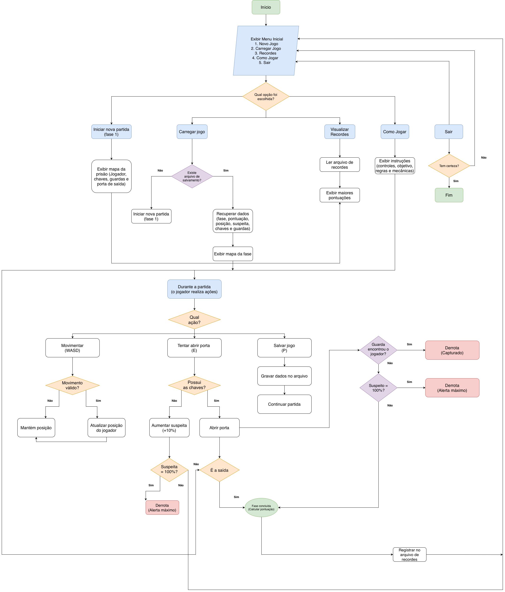

# Projeto do jogo: Fuga da Prisão

## 1. Descrição do Sistema

No jogo fuga da prisão, o jogador tem como missão escapar de uma prisão representada por um labirinto. Para conseguir fugir, o jogador deverá explorar o mapa em busca das chaves necessárias para abrir a porta da prisão, enquanto evita os guardas responsáveis por patrulhar o local. Caso o jogador seja encontrado por um guarda ou atinja o nível máximo de suspeita, a partida será encerrada com derrota, então seja agil e cauteloso ou fuja antes que eles te pegem!            

Durante a partida, o jogador poderá se movimentar pelo mapa e interagir com elementos presentes no cenário. Algumas ações poderão aumentar o nível de suspeita, exigindo que o jogador tome cuidado com certas interações para conseguir avançar pelas fases sem ser capturado. Ao concluir a fase, a pontuação do jogador será calculada e poderá ser registrada no sistema de recordes.

Este jogo foi criado com o desígnio de explorar e aumentar as acuidades dos educandos na Unicesumar do curso de Engenharia de Software. Voltado a matéria "Linguagens e técnicas de programação" e intruido pelo Professor Dácio Machado, nosso projeto foi desenvolvido na linguagem C e criado para rodar em terminal.

## 2. Fluxo de Utilização Esperado para o Sistema

`1. Novo Jogo`<br>
`2. Carregar Jogo`<br>
`3. Recordes`<br>
`4. Como Jogar`<br>
`5. Sair`<br>

`Escolha uma opção:`<br>

**1. Novo Jogo:** inicia uma nova partida, colocando o jogador na primeira fase da prisão e apresentando o mapa, os guardas, as chaves e a porta de saída.

**2. Carregar Jogo:** verifica se existe um arquivo de salvamento. Se existir, recupera os dados da partida (fase, pontuação, posição, suspeita, chaves e guardas) e exibe o mapa da fase para o jogador continuar de onde parou. Se não existir, inicia uma nova partida na fase 1.

**3. Recordes:** apresenta as maiores pontuações obtidas nas partidas anteriores, realizando a leitura dos dados armazenados no arquivo de recordes.

**4. Como Jogar:** apresenta as instruções do jogo, incluindo os controles, objetivo da partida e regras relacionadas às chaves, porta, guardas, suspeita e pontuação.

**5. Sair:** encerra o programa. O sistema poderá solicitar uma confirmação antes de fechar o jogo.

Após a execução de qualquer opção que não seja `5. Sair`, o sistema poderá retornar ao menu inicial, permitindo que o jogador escolha outra funcionalidade.

## 3. Fluxograma da Lógica do Sistema

O fluxograma abaixo apresenta o funcionamento geral planejado para o jogo, incluindo o menu principal, carregamento de partidas, movimentação, sistema de chaves, portas, guardas, nível de suspeita, salvamento, derrota e conclusão das fases.



## 4. Estrutura de Dados

Para o desenvolvimento do jogo **Fuga da Prisão**, serão utilizadas diferentes estruturas de dados da linguagem C para organizar e manipular as informações necessárias durante a execução da partida.

Serão utilizadas estruturas homogêneas, como **vetores, strings e matrizes**, além de estruturas heterogêneas utilizando `struct`.

As estruturas apresentadas a seguir representam o planejamento inicial do projeto e poderão sofrer pequenos ajustes durante a implementação.

### 4.1. Mapa

Cada fase da prisão será representada por uma **matriz bidimensional de caracteres**.

Exemplo:

```c id="9lk16b"
char mapa[20][40];
```

Cada posição da matriz representará uma posição do cenário.

Uma possível representação será:

```text id="yqlcr7"
########################################
#.............#........................#
#....@........#...........G............#
#.............#####....................#
#......................C...............#
#.................########.............#
#..................................P...#
########################################
```

Os principais símbolos utilizados poderão ser:

| Símbolo | Representação       |
| ------- | ------------------- |
| `#`     | Parede ou obstáculo |
| `.`     | Espaço livre        |
| `@`     | Jogador             |
| `G`     | Guarda              |
| `C`     | Chave               |
| `P`     | Porta ou saída      |

A matriz será utilizada para apresentar o cenário no terminal e auxiliar na verificação de movimentação, colisões e interação com os elementos do mapa.

---

### 4.2. Jogador

As informações relacionadas ao jogador serão armazenadas utilizando uma estrutura.

```c id="lqlcgv"
typedef struct
{
    int posicaoX;
    int posicaoY;
    int faseAtual;
    int nivelSuspeita;
    int pontuacao;
    int capturado;
} Jogador;
```

| Campo           | Finalidade                               |
| --------------- | ---------------------------------------- |
| `posicaoX`      | Armazena a posição horizontal do jogador |
| `posicaoY`      | Armazena a posição vertical do jogador   |
| `faseAtual`     | Identifica a fase atual                  |
| `nivelSuspeita` | Armazena o nível de suspeita do jogador  |
| `pontuacao`     | Armazena a pontuação obtida              |
| `capturado`     | Indica se o jogador foi capturado        |

A estrutura permitirá manter reunidas as principais informações referentes ao estado do jogador.

---

### 4.3. Guardas

Cada guarda possuirá informações próprias relacionadas à sua posição e estado dentro da fase.

```c id="2s58a4"
typedef struct
{
    int posicaoX;
    int posicaoY;
    int direcao;
    int ativo;
} Guarda;
```

Como poderão existir vários guardas simultaneamente, será utilizado um **vetor de estruturas**:

```c id="91kdke"
Guarda guardas[10];
```

| Campo      | Finalidade                            |
| ---------- | ------------------------------------- |
| `posicaoX` | Posição horizontal do guarda          |
| `posicaoY` | Posição vertical do guarda            |
| `direcao`  | Direção atual de patrulhamento        |
| `ativo`    | Indica se o guarda está ativo na fase |

O vetor permitirá que o programa percorra os guardas utilizando estruturas de repetição para atualizar suas posições e verificar possíveis encontros com o jogador.

---

### 4.4. Chaves

As chaves serão elementos necessários para liberar determinadas saídas durante a fuga.

```c id="okja4q"
typedef struct
{
    int posicaoX;
    int posicaoY;
    int coletada;
} Chave;
```

Caso existam várias chaves em uma fase, será utilizado um vetor:

```c id="04ntiq"
Chave chaves[5];
```

| Campo      | Finalidade                        |
| ---------- | --------------------------------- |
| `posicaoX` | Posição horizontal da chave       |
| `posicaoY` | Posição vertical da chave         |
| `coletada` | Indica se a chave já foi coletada |

O estado das chaves também será considerado durante o salvamento da partida para impedir que itens já coletados reapareçam ao carregar o jogo.

---

### 4.5. Porta de Saída

A saída de uma fase poderá ser representada pela seguinte estrutura:

```c id="cj62wq"
typedef struct
{
    int posicaoX;
    int posicaoY;
    int aberta;
} Porta;
```

| Campo      | Finalidade                           |
| ---------- | ------------------------------------ |
| `posicaoX` | Posição horizontal da porta          |
| `posicaoY` | Posição vertical da porta            |
| `aberta`   | Indica se a porta pode ser utilizada |

Quando o jogador tentar utilizar a saída, o programa verificará se as condições necessárias foram atendidas, como a obtenção das chaves exigidas.

---

### 4.6. Fases

O jogo será dividido em diferentes setores da prisão.

Cada fase poderá possuir informações próprias:

```c id="0wrvdf"
typedef struct
{
    int numero;
    char nome[30];
    int quantidadeGuardas;
    int quantidadeChaves;
    int concluida;
} Fase;
```

As fases poderão ser armazenadas em um vetor:

```c id="9rtwv6"
Fase fases[5];
```

Uma possível organização será:

```text id="qmyrdp"
Fase 1 - Celas
Fase 2 - Corredores
Fase 3 - Pátio
Fase 4 - Área Administrativa
Fase 5 - Saída da Prisão
```

A quantidade e os nomes definitivos poderão ser modificados durante o desenvolvimento.

---

### 4.7. Estado da Partida

As principais informações necessárias para salvar e recuperar uma partida poderão ser agrupadas em uma estrutura.

```c id="begj82"
typedef struct
{
    Jogador jogador;
    Guarda guardas[10];
    Chave chaves[5];
    Porta porta;
    int quantidadeGuardas;
    int quantidadeChaves;
} EstadoJogo;
```

A estrutura permitirá reunir dados como:

* estado do jogador;
* posição dos guardas;
* estado das chaves;
* estado da porta;
* quantidade de guardas;
* quantidade de chaves.

Essas informações serão utilizadas pelo sistema de salvamento e carregamento.

---

### 4.8. Strings

Strings serão utilizadas para armazenar informações textuais utilizadas pelo programa, como nomes das fases e mensagens exibidas ao jogador.

Exemplos:

```c id="yhm68m"
char nomeFase[30];
char mensagem[100];
```

Em C, essas informações serão representadas utilizando vetores de caracteres.

---

### 4.9. Recordes

Os resultados obtidos pelos jogadores poderão ser representados utilizando uma estrutura.

```c id="a2h5ts"
typedef struct
{
    int pontuacao;
    int faseAlcancada;
} Recorde;
```

Os registros poderão ser armazenados temporariamente em um vetor durante a execução:

```c id="b2z96g"
Recorde recordes[10];
```

Posteriormente, essas informações poderão ser organizadas e apresentadas pela opção **Recordes** do menu principal.

---

### 4.10. Arquivo de Salvamento

O jogo utilizará um arquivo para permitir que o progresso seja recuperado posteriormente.

Nome planejado:

```text id="1fh87s"
save.txt
```

O arquivo deverá armazenar informações como:

* fase atual;
* posição do jogador;
* pontuação;
* nível de suspeita;
* estado das chaves;
* estado dos guardas;
* estado da porta.

Ao selecionar **Carregar Jogo**, o programa verificará a existência do arquivo antes de tentar realizar sua leitura.

Caso o arquivo não exista ou não possa ser aberto, uma mensagem deverá ser apresentada ao usuário.

Todo arquivo aberto pelo programa deverá ser fechado após as operações necessárias.

---

### 4.11. Arquivo de Recordes

As maiores pontuações obtidas serão armazenadas separadamente.

Nome planejado:

```text id="2zj0ed"
recordes.txt
```

Ao finalizar uma partida, o programa poderá atualizar esse arquivo de acordo com a pontuação obtida.

Ao selecionar a opção **Recordes**, o arquivo será aberto para leitura e seus dados serão apresentados ao jogador.

Caso não existam recordes registrados ou o arquivo ainda não tenha sido criado, o usuário receberá uma mensagem informativa.

---

### 4.12. Resumo das Estruturas de Dados

| Informação | Estrutura planejada       | Aplicação                    |
| ---------- | ------------------------- | ---------------------------- |
| Mapa       | Matriz de `char`          | Representação do cenário     |
| Textos     | Strings                   | Nomes e mensagens            |
| Jogador    | `struct Jogador`          | Estado do personagem         |
| Guardas    | Vetor de `struct Guarda`  | Patrulhamento e detecção     |
| Chaves     | Vetor de `struct Chave`   | Controle dos itens coletados |
| Porta      | `struct Porta`            | Controle da saída            |
| Fases      | Vetor de `struct Fase`    | Organização dos setores      |
| Partida    | `struct EstadoJogo`       | Salvamento e carregamento    |
| Recordes   | Vetor de `struct Recorde` | Controle das pontuações      |
| Salvamento | Arquivo                   | Persistência da partida      |
| Recordes   | Arquivo                   | Persistência das pontuações  |

---

## 5. Estrutura Lógica e Modularização Planejada

Para facilitar a organização e manutenção do código, o projeto será dividido em diferentes arquivos e módulos.

Uma possível organização será:

```text id="a6i9c2"
Fuga-da-Prisao
│
├── main.c
│
├── game.c
├── game.h
│
├── mapa.c
├── mapa.h
│
├── jogador.c
├── jogador.h
│
├── guardas.c
├── guardas.h
│
├── fase.c
├── fase.h
│
├── arquivos.c
├── arquivos.h
│
├── save.txt
├── recordes.txt
├── fluxograma_fundo_branco.png
└── README.md
```

As responsabilidades serão divididas inicialmente da seguinte maneira:

| Módulo                    | Responsabilidade                                   |
| ------------------------- | -------------------------------------------------- |
| main.c                  | Inicialização do programa e controle principal     |
| game.c / game.h         | Menu e fluxo geral da partida                      |
| mapa.c / mapa.h         | Exibição do mapa, movimentação e colisões          |
| jogador.c / jogador.h   | Dados e ações relacionadas ao jogador              |
| guardas.c / guardas.h   | Movimentação, patrulhamento e detecção dos guardas |
| fase.c / fase.h         | Chaves, portas e progressão das fases              |
| arquivos.c / arquivos.h | Salvamento, carregamento e recordes                |

Essa divisão tem como objetivo evitar a concentração de toda a lógica em um único arquivo, facilitando a modularização e a organização do projeto.

---

## 6. Conceitos da Linguagem C Planejados

Durante o desenvolvimento do projeto serão aplicados os seguintes conceitos:

* funções de entrada e saída;
* estruturas condicionais;
* estruturas de repetição;
* funções e modularização;
* vetores;
* strings;
* matrizes;
* estruturas (struct);
* vetores de estruturas;
* leitura e escrita em arquivos;
* divisão do projeto em arquivos .c e .h.

Esses recursos serão utilizados de acordo com as necessidades de cada módulo do jogo.
